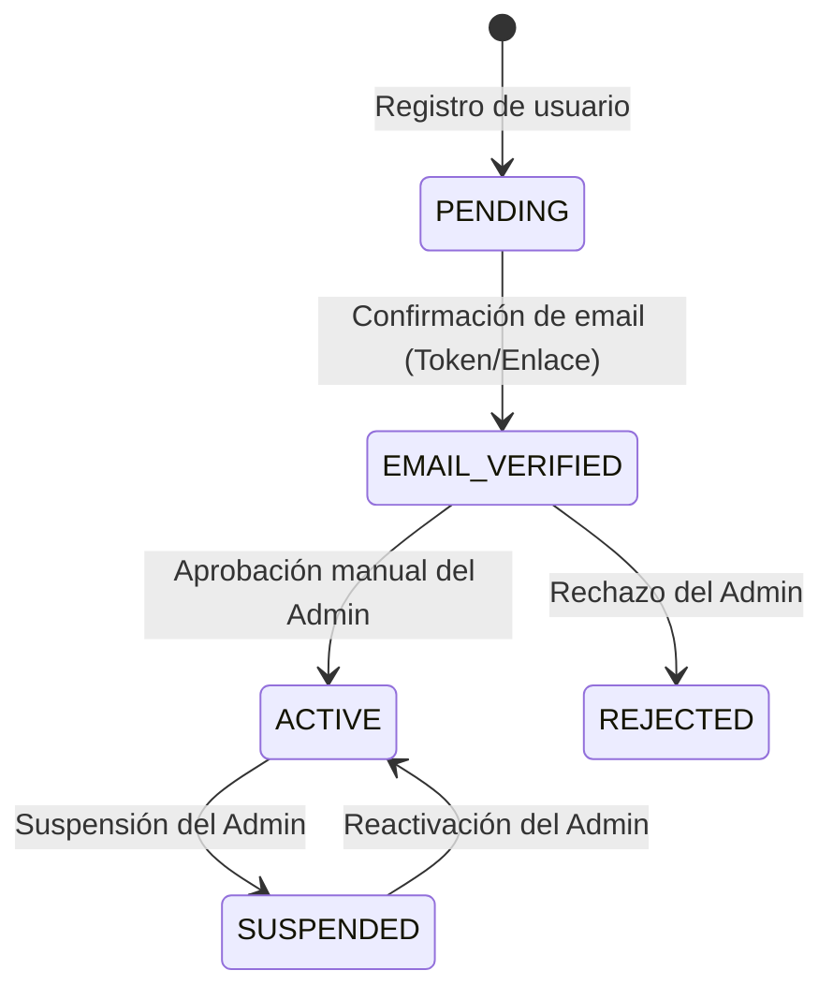

# Auth Account Flow Skill

## Description
Convenciones de autenticación, estados de cuenta y RBAC. Usar al tocar auth, usuarios, permisos o el flujo de aprobación del admin.

## User Account Lifecycle

### States:
- **PENDING**: Cuenta creada pero correo no verificado. No puede iniciar sesión.
- **EMAIL_VERIFIED**: Correo confirmado. Cuenta en espera de aprobación por el Administrador. No puede operar aún.
- **ACTIVE**: Aprobado por el Administrador. Cuenta completamente operativa.
- **REJECTED**: Rechazado por el Administrador.
- **SUSPENDED**: Suspendido temporalmente por el Administrador.

## RBAC (Role-Based Access Control)
- **ADMIN**: Acceso total al panel de administración, gestión de usuarios (aprobar/suspender/rechazar) y gestión de turnos (crear, editar, cancelar).
- **CLIENT**: Acceso al portal de cliente, visualizar turnos disponibles, reservar turnos y cancelar turnos propios.

## Security Rules
- Hashing seguro de contraseñas usando `bcryptjs` o similar.
- Control de acceso en las rutas de API y Server Actions validando la sesión y el rol.
- Exclusión de datos sensibles (como `hashedPassword`) en todas las respuestas de API.
